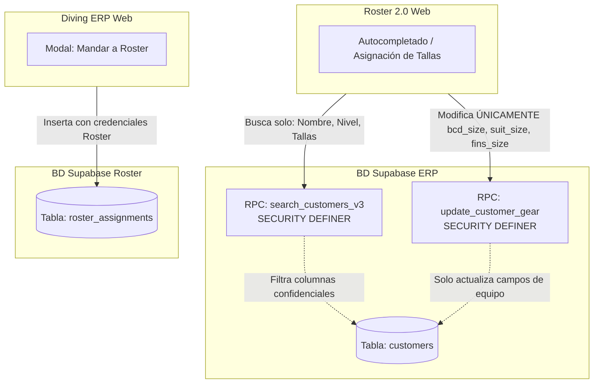
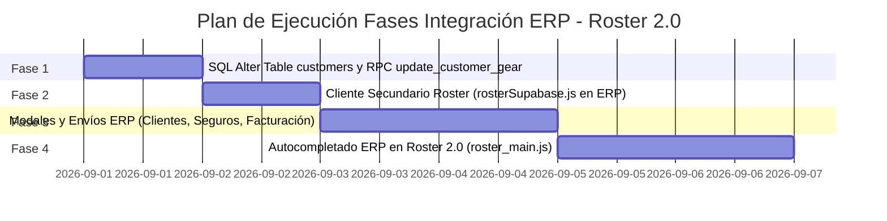

# 📖 ESPECIFICACIÓN TÉCNICA Y PLAN DE INTEGRACIÓN: DIVING ERP ↔ ROSTER 2.0

> **Estado**: Documento de planificación y especificación técnica guardado para futura ejecución.
> **Versión del ERP al momento de guardar**: v1.5.0
> **Versión del Roster al momento de guardar**: v2.0.5

---

## 📌 1. Visión General del Proyecto

El objetivo de esta integración es conectar de forma fluida y segura el sistema **Diving ERP** (`d:\Projects\diving-erp`) con la aplicación web **Roster 2.0** (`d:\Projects\app\roster`).

Permitirá que el personal de administración y recepción del centro de buceo envíe alumnos y buceadores desde el ERP (vistas de **Clientes**, **Seguros** y **Facturación**) directamente a la tabla del Roster diario, asignando turnos (Mañana/Tarde), instructores, cursos y registrando automáticamente las tallas de equipo de cada buceador.

---

## 🏛️ 2. Arquitectura de Sistemas y Seguridad

### Entornos de Supabase
Las dos aplicaciones se ejecutan en **proyectos de Supabase independientes** (dentro de la misma cuenta de usuario):

| Aplicación | Proyecto Supabase | URL del Proyecto | Tabla Principal |
| :--- | :--- | :--- | :--- |
| **Diving ERP** | ERP Database | *(Configurada en `src/lib/supabaseClient.js`)* | `customers`, `invoices`, `invoice_items` |
| **Roster 2.0** | Roster Database | `https://rjsfwbfgmxzcxugeaamp.supabase.co` | `roster_assignments`, `roster_config` |

---

### 🛡️ Modelo de Seguridad y Permisos Blindado

Para garantizar que los usuarios del Roster (instructores) **no puedan acceder a datos confidenciales del ERP** (facturación, pasaportes, correos, ingresos):



1. **Lectura desde Roster (Búsqueda)**:
   - La web del Roster consulta al ERP mediante la función RPC `search_customers_v3` ejecutada con `SECURITY DEFINER`.
   - Devuelve **únicamente**: `id`, `first_name`, `last_name`, `level`, `bcd_size`, `suit_size`, `fins_size`.
   - **No devuelve**: ni emails, ni direcciones, ni pasaportes, ni datos de facturas.

2. **Escritura desde Roster (Tallas de Equipo)**:
   - Se crea en el Supabase del ERP la función RPC `update_customer_gear(p_customer_id, p_bcd, p_suit, p_fins)`.
   - Esta función **solo puede actualizar las 3 columnas de equipo**. Es técnicamente imposible alterar cualquier otro dato personal o contable.

---

## 🛢️ 3. Cambios en la Base de Datos del ERP (SQL Scripts)

### A. Modificación de la tabla `customers`
Se deben añadir 3 columnas a la tabla `customers` en el Supabase del ERP:

```sql
-- Añadir campos para tallas de equipo de buceo en el ERP
ALTER TABLE customers 
ADD COLUMN IF NOT EXISTS bcd_size VARCHAR(10),
ADD COLUMN IF NOT EXISTS suit_size VARCHAR(10),
ADD COLUMN IF NOT EXISTS fins_size VARCHAR(15);
```

### B. Creación de la función RPC `update_customer_gear`
Ejecutar en el Editor SQL del proyecto Supabase del ERP:

```sql
CREATE OR REPLACE FUNCTION update_customer_gear(
    p_customer_id UUID,
    p_bcd VARCHAR DEFAULT NULL,
    p_suit VARCHAR DEFAULT NULL,
    p_fins VARCHAR DEFAULT NULL
)
RETURNS VOID AS $$
BEGIN
    UPDATE customers 
    SET 
        bcd_size = COALESCE(NULLIF(p_bcd, ''), bcd_size),
        suit_size = COALESCE(NULLIF(p_suit, ''), suit_size),
        fins_size = COALESCE(NULLIF(p_fins, ''), fins_size),
        updated_at = NOW()
    WHERE id = p_customer_id;
END;
$$ LANGUAGE plpgsql SECURITY DEFINER;
```

---

## 🔤 4. Reglas de Formato de Nombres y Reglas de Negocio

### A. Formato de Nombre Compacto para el Roster (`nombre_alumno`)
Para que las filas del Roster permanezcan limpias y legibles en tablets y ordenadores:

```javascript
/**
 * Convierte el nombre completo del ERP al formato de Roster: Nombre + Iniciales de Apellidos
 * Ejemplo: "Carlos Julia Revilla" -> "Carlos J.R."
 * Ejemplo: "Maria Garcia" -> "Maria G."
 */
export function formatRosterName(firstName, lastName) {
  const first = (firstName || '').trim();
  const lastParts = (lastName || '').trim().split(/\s+/).filter(Boolean);
  
  if (!lastParts.length) return first;
  
  const initials = lastParts.map(part => part[0].toUpperCase() + '.').join('');
  return `${first} ${initials}`;
}
```

---

### B. Matriz de Mapeo de Actividades y Programación Automática Multi-Día

| Actividad ERP | Código Roster (`activity`) | Duración | Regla de Programación Automática | Turnos por Defecto |
| :--- | :--- | :--- | :--- | :--- |
| **Fun Dives** | `FD` | 1 Día | 1 Fila en la fecha seleccionada | ☀️ **MAÑANA** (`morning`) |
| **Bautizo / Try Dive** | `DSD` | 1 Día | 1 Fila en la fecha seleccionada | 🌙 **TARDE** (`afternoon`) |
| **Open Water** | `CONF`, `1+2`, `3+4` | 3 Días | **Genera 3 Filas Consecutivas**: <br>• **Día 1**: `CONF` en Turno **TARDE**<br>• **Día 2**: `1+2` en Turno **TARDE**<br>• **Día 3**: `3+4` en Turno **MAÑANA** | 🌙 Tarde / 🌙 Tarde / ☀️ Mañana |
| **Scuba Diver** | `CONF`, `1+2` | 2 Días | **Genera 2 Filas Consecutivas**: <br>• **Día 1**: `CONF` en Turno **TARDE**<br>• **Día 2**: `1+2` en Turno **TARDE** | 🌙 Tarde / 🌙 Tarde |
| **Advanced Open Water** | `AOW` / `AA` | 2 Días | Genera filas según selección en el modal | ☀️ **MAÑANA** (`morning`) |
| **Refresher / Refresh** | `REF` | 1 Día | 1 Fila en la fecha seleccionada | ☀️ **MAÑANA** o 🌙 **TARDE** |

---

## 🖥️ 5. Especificaciones de UI/UX en las Vistas del ERP

### A. Vista de Clientes (`Customers_View.jsx`)
- **Acción Individual**: Botón *"Mandar a Roster"* en la fila o en la ficha de detalle.
- **Acción Masiva**: Botón *"Mandar a Roster"* en la barra flotante de selección múltiple.
- **Modal emergente**:
  - Selector de **Fecha de Inicio** (predeterminado: mañana).
  - Selector de **Curso / Actividad** (mapeado automático).
  - Selector de **Instructor** (desplegable opcional).

### B. Vista de Seguros (`InsuranceView.jsx`)
- Casilla de verificación: **☑️ Mandar también al Roster** (junto a la opción de mandar a Facturación).
- Al procesar el alta de seguros de un lote (ej. Fun Dives), los añade directamente al Roster de la fecha correspondiente.

### C. Vista de Facturación (`Billing_View.jsx`)
- Botón **"Mandar a Roster"** en las filas o barra masiva de Facturación.
- Transfiere automáticamente:
  - **Instructor** asignado en la fila de Facturación (mapeado a la columna `staff` del Roster).
  - **Actividad** y **Fecha de Llegada**.
  - **Cliente y Tallas pre-guardadas**.

---

## 🗺️ 6. Hoja de Ruta de Implementación por Fases



### **Fase 1: Base de Datos ERP**
1. Ejecutar script SQL de columnas de equipo (`bcd_size`, `suit_size`, `fins_size`) en la BD del ERP.
2. Crear la función RPC `update_customer_gear` con `SECURITY DEFINER`.

### **Fase 2: Conector Roster en el ERP (`rosterClient.js`)**
1. Crear helper cliente en `src/lib/rosterSupabaseClient.js` con la URL `https://rjsfwbfgmxzcxugeaamp.supabase.co` y su Anon Key.
2. Implementar funciones auxiliares para insertar filas en `roster_assignments`.

### **Fase 3: Lógica de Envío desde el ERP**
1. Implementar la función de formato `formatRosterName(firstName, lastName)`.
2. Crear el modal reutilizable `<SendToRosterModal />` en el ERP.
3. Añadir la lógica de programación automática multi-día para Open Water (3 días) y Scuba Diver (2 días).
4. Conectar los botones en las vistas de **Clientes**, **Seguros** y **Facturación** (este último conservando el Instructor).

### **Fase 4: Integración en la App Roster 2.0 (`d:\Projects\app\roster`)**
1. En `roster_main.js`, integrar el autocompletado en el campo `nombre_alumno` consultando a `search_customers_v3` del ERP.
2. Al seleccionar un cliente, autollenar automáticamente las tallas de equipo.
3. Al editar tallas en el Roster, invocar `update_customer_gear` para actualizar la ficha en el ERP.

---

## 📝 7. Registro de Cambios y Estado

- **Fecha de creación de este plan**: 16 de Agosto de 2026
- **Estado**: Archivo de especificación listo y probado conceptualmente. Guardado en `PLAN_INTEGRACION_ROSTER.md` para su posterior ejecución a petición del usuario.
