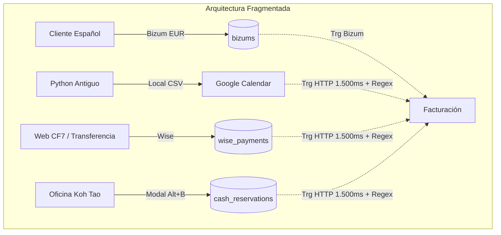
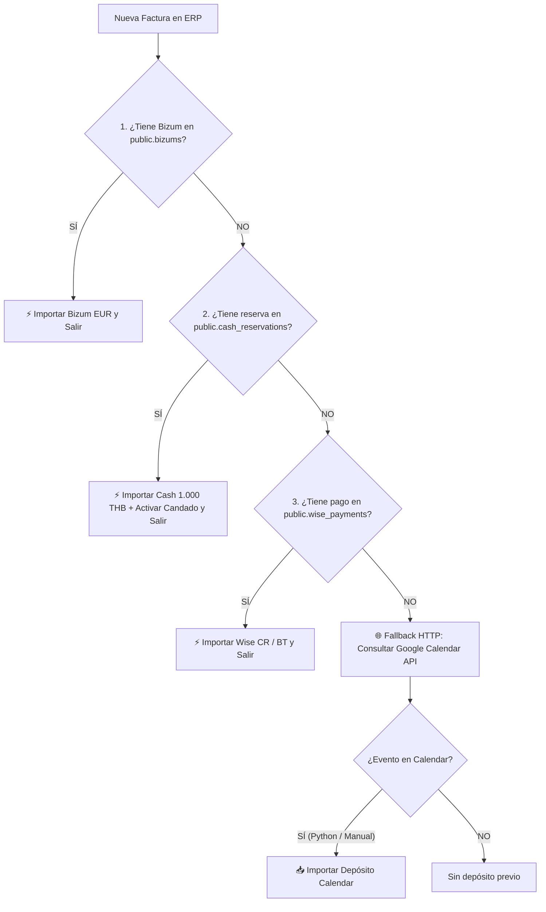

# PLAN MAESTRO: Unificación del Sistema de Reservas en Diving ERP

**Fecha de Creación:** Octubre 2026  
**Objetivo:** Consolidar las 3 tablas y flujos aislados (`bizums`, `wise_payments`, `cash_reservations`) en una única entidad maestra relacional (`public.reservations`), eliminando la dependencia de llamadas HTTP a Google Calendar en facturación y resolviendo de raíz la asignación de pagos a socios (CR vs BT / Revolut).  
**Ventana de Ejecución:** Próxima temporada baja.

---

## 1. Contexto y Diagnóstico Actual

### 1.1 La Deuda Técnica Heredada
Actualmente, Diving ERP gestiona los depósitos de reserva a través de tres subsistemas separados debido a su evolución histórica:

1. **`public.bizums`**: Depósitos en euros (€25/pax) para clientes españoles.
2. **`public.wise_payments`**: Depósitos en bahts/divisas gestionados mediante formulario web WordPress (Contact Form 7) y correos automáticos.
3. **`public.cash_reservations`**: Depósitos en efectivo de Koh Tao creados para sustituir el script local de Python (`Addtocalendar 5.2`).



### 1.2 Problemas Identificados en el Día a Día

1. **Confusión de Cobro entre Socios (Revolut CR vs Wise BT):**
   - Cuando un cliente no puede pagar con Wise y Carlos le envía un link de Revolut, el cliente rellena el formulario web y el sistema lo marca ciegamente como `WISE BT` (cuenta de Berta), asignándole el cobro erróneamente en las liquidaciones a menos que se edite manualmente en Google Calendar.
2. **Latencia y Fragilidad en Facturación:**
   - Para saber si hay depósito, el trigger de facturación (`fn_trg_billing_auto_import_calendar_deposit`) realiza una petición HTTP externa a la API de Google Calendar (**1.000 a 1.800 ms**), dependiendo de tokens OAuth, cuotas de red y de parsear texto HTML con expresiones regulares (`Reserva: 1 personas -> 1000 thb a ...`).
3. **Fragmentación en la Interfaz (3 Subpestañas):**
   - El personal y los socios tienen que saltar entre tres tablas diferentes para consultar depósitos, calcular totales mensuales o verificar pagos.

---

## 2. La Hoja de Ruta en 3 Fases

Tal como plantea la evolución natural del sistema, la migración se dividirá en **3 fases lógicas sin riesgo operativo**:

```mermaid
graph TD
    subgraph Fase 1 [FASE 1: Híbrido con las 3 Tablas Actuales]
        F1_A[Factura ERP] --> F1_B{¿Está en Bizum, Cash o Wise?}
        F1_B -- SÍ (Encontrado) --> F1_C[⚡ Importar Depósito en 1 ms]
        F1_B -- NO (Python/Manual) --> F1_D[🌐 Fallback HTTP: Google Calendar]
    end

    subgraph Fase 2 [FASE 2: Unificación a 1 Sola Tabla]
        F2_A[Factura ERP] --> F2_B{¿Está en public.reservations?}
        F2_B -- SÍ (Encontrado) --> F2_C[⚡ Importar Depósito en 1 ms]
        F2_B -- NO (Python/Manual) --> F2_D[🌐 Fallback HTTP: Google Calendar]
    end

    subgraph Fase 3 [FASE 3: Desconexión Definitiva de Calendar]
        F3_A[Factura ERP] --> F3_B{¿Está en public.reservations?}
        F3_B -- SÍ --> F3_C[⚡ Importar Depósito en 1 ms]
        F3_B -- NO --> F3_D[Sin depósito - Fin]
    end

    Fase 1 ==> Fase 2 ==> Fase 3
```

### 2.1 Definición de Cada Fase

1. **FASE 1 — Inmediata (3 Tablas en BD -> Fallback Calendar):**
   * **Objetivo:** Evitar desde ya el 90-95% de las llamadas lentas a Google Calendar sin necesidad de migrar la estructura de la base de datos todavía.
   * **Cómo funciona:** Al crear la factura, el disparador comprueba sucesivamente en la BD interna:
     1. ¿Existe depósito en `public.bizums`?
     2. ¿Existe reserva en efectivo en `public.cash_reservations`?
     3. ¿Existe pago por transferencia en `public.wise_payments`?
   * Si está en alguna de las 3, se importa al instante (1 ms) y **no se llama a Google Calendar**.
   * Solo si **no se encuentra en ninguna de las 3 tablas**, se lanza la petición HTTP de fallback a Google Calendar para rescatar reservas creadas desde el viejo Python (`Addtocalendar 5.2`) o metidas a mano.

2. **FASE 2 — Temporada Baja (1 Sola Tabla Unificada -> Fallback Calendar):**
   * **Objetivo:** Consolidar `bizums`, `wise_payments` y `cash_reservations` en una única tabla relacional (`public.reservations`).
   * **Cómo funciona:** El disparador de facturación se simplifica: ahora solo consulta `public.reservations`. Sigue manteniendo el fallback a Google Calendar mientras se termina de extinguir el uso del script de Python.

3. **FASE 3 — Definitiva (100% BD Interna):**
   * **Objetivo:** Retirar completamente el script de Python `Addtocalendar 5.2`.
   * **Cómo funciona:** Todo el equipo usa exclusivamente el ERP. Se elimina la llamada HTTP de fallback a Google Calendar. Google Calendar pasa a ser únicamente una vista de agenda para los teléfonos de los instructores.

### 2.2 Comparativa de Rendimiento y Seguridad

| Métrica / Escenario | Antes (Solo Calendar) | Fase 1 (3 Tablas -> Fallback) | Fase 2 (1 Tabla -> Fallback) | Fase 3 (100% BD) |
| :--- | :--- | :--- | :--- | :--- |
| **Reservas creadas en ERP/Web** | 1.500 ms (HTTP Google) | **1 ms (Consulta SQL local)** | **1 ms (Consulta SQL local)** | **1 ms (SQL local)** |
| **Reservas del Python antiguo** | 1.500 ms (HTTP Google) | 1.500 ms (Fallback Calendar) | 1.500 ms (Fallback Calendar) | *(Python retirado)* |
| **Peticiones HTTP a Google API**| 100% de las facturas | **< 10% (Solo las no en BD)** | **< 5%** | **0% en facturación** |
| **Riesgo de perder depósitos**   | Medio (Caídas de red Google)| **Cero (Cubre BD + Calendar)**| **Cero (Cubre BD + Calendar)**| **Cero (Consistencia BD)** |

---

## 3. Modelo de Datos Maestro (`public.reservations`)

### 3.1 Estructura DDL en Supabase
```sql
CREATE TYPE public.reservation_payment_method AS ENUM (
  'CASH',
  'BIZUM_CR',
  'BIZUM_BT',
  'WISE_BT',
  'WISE_CR',
  'REVOLUT_CR',
  'REVOLUT_BT',
  'BANK_TRANSFER'
);

CREATE TYPE public.reservation_status AS ENUM (
  'pending',     -- Registrada / Pendiente de verificación o llegada
  'confirmed',   -- Confirmada con depósito verificado
  'invoiced',    -- Facturada y consumida en Facturación (Candado activo)
  'retained',    -- Depósito retenido (cancelación cliente / no show)
  'returned',    -- Depósito devuelto al cliente
  'cancelled'    -- Cancelada sin coste
);

CREATE TABLE public.reservations (
    id uuid DEFAULT gen_random_uuid() PRIMARY KEY,
    created_at timestamptz DEFAULT timezone('utc'::text, now()) NOT NULL,
    booking_date date NOT NULL,
    
    -- Datos del Cliente
    customer_id uuid REFERENCES public.customers(id) ON DELETE SET NULL,
    customer_name text NOT NULL,
    phone text DEFAULT ''::text,
    email text DEFAULT ''::text,
    is_english boolean DEFAULT false NOT NULL,
    
    -- Cursos / Actividades
    activity_summary text NOT NULL,          -- Ej: 'OW (in 2 days)x1 + RESx1 + AAx1'
    activities_detail jsonb DEFAULT '[]'::jsonb, -- Desglose estructurado de cursos y pax
    num_people integer DEFAULT 1 NOT NULL,
    
    -- Aspectos Financieros y Liquidación
    payment_method public.reservation_payment_method NOT NULL,
    recipient_partner text NOT NULL CHECK (recipient_partner IN ('CR', 'BT', 'IHASIA')),
    deposit_amount numeric DEFAULT 0 NOT NULL,
    deposit_currency text DEFAULT 'THB' NOT NULL CHECK (deposit_currency IN ('THB', 'EUR')),
    deposit_thb_equivalent numeric DEFAULT 0 NOT NULL, -- Normalizado para balances
    
    -- Estado y Candado de Facturación
    status public.reservation_status DEFAULT 'confirmed' NOT NULL,
    invoice_id uuid REFERENCES public.invoices(id) ON DELETE SET NULL,
    invoiced_at timestamptz,
    
    -- Integración Google Calendar
    calendar_event_id text,
    calendar_html_link text,
    
    -- Notas y Metadatos
    source text DEFAULT 'erp_modal' NOT NULL, -- 'erp_modal', 'cf7_web', 'historical_import'
    notes text DEFAULT ''::text
);

-- Índices de alto rendimiento
CREATE INDEX idx_reservations_booking_date ON public.reservations(booking_date);
CREATE INDEX idx_reservations_customer_id ON public.reservations(customer_id);
CREATE INDEX idx_reservations_status_invoice ON public.reservations(status, invoice_id);
CREATE INDEX idx_reservations_phone ON public.reservations(phone);
```

---

## 4. Estrategia de Migración del Histórico

Para no perder ni un solo dato, se ejecutará un script de migración idempotente que unifique los registros existentes:

```sql
-- 1. Migración desde cash_reservations
INSERT INTO public.reservations (
    id, created_at, booking_date, customer_id, customer_name,
    phone, activity_summary, num_people, payment_method,
    recipient_partner, deposit_amount, deposit_currency, deposit_thb_equivalent,
    status, invoice_id, invoiced_at, calendar_html_link, source, notes
)
SELECT 
    id, created_at, booking_date, customer_id, 
    trim(first_name || ' ' || COALESCE(last_name, '')),
    phone, COALESCE(activity_code, 'OWx1'), COALESCE(num_people, 1),
    'CASH'::public.reservation_payment_method,
    'IHASIA',
    COALESCE(amount_thb, 1000), 'THB', COALESCE(amount_thb, 1000),
    CASE WHEN imported_to_invoice = true THEN 'invoiced'::public.reservation_status ELSE 'confirmed'::public.reservation_status END,
    invoice_id, imported_at, calendar_html_link, 'cash_legacy', notes
FROM public.cash_reservations;

-- 2. Migración desde wise_payments
-- (Se mapea titular_wise o sender_name para detectar si fue a CR o BT)
INSERT INTO public.reservations (
    booking_date, customer_id, customer_name, phone,
    activity_summary, num_people, payment_method, recipient_partner,
    deposit_amount, deposit_currency, deposit_thb_equivalent,
    status, source, notes
)
SELECT 
    COALESCE(booking_date, created_at::date), NULL, sender_name, phone,
    COALESCE(activity, 'OWx1'), num_people,
    CASE 
        WHEN titular_wise ILIKE '%carlos%' OR notes ILIKE '%revolut%' THEN 'WISE_CR'::public.reservation_payment_method
        ELSE 'WISE_BT'::public.reservation_payment_method
    END,
    CASE 
        WHEN titular_wise ILIKE '%carlos%' OR notes ILIKE '%revolut%' THEN 'CR'
        ELSE 'BT'
    END,
    amount_raw, COALESCE(currency, 'THB'), 
    CASE WHEN currency = 'EUR' THEN amount_raw * 38 ELSE amount_raw END,
    CASE 
        WHEN is_settled THEN 'invoiced'::public.reservation_status
        WHEN is_retained THEN 'retained'::public.reservation_status
        ELSE 'confirmed'::public.reservation_status
    END,
    'wise_legacy', notes
FROM public.wise_payments;

-- 3. Migración desde bizums
INSERT INTO public.reservations (
    booking_date, customer_id, customer_name, phone,
    activity_summary, num_people, payment_method, recipient_partner,
    deposit_amount, deposit_currency, deposit_thb_equivalent,
    status, source, notes
)
SELECT 
    COALESCE(booking_date, created_at::date), customer_id, customer_name, phone,
    COALESCE(activity_summary, 'OWx1'), COALESCE(pax, 1),
    'BIZUM_CR'::public.reservation_payment_method, 'CR',
    COALESCE(amount_eur, 25), 'EUR', COALESCE(amount_eur, 25) * 38,
    CASE 
        WHEN is_settled THEN 'invoiced'::public.reservation_status
        WHEN is_retained THEN 'retained'::public.reservation_status
        WHEN is_returned THEN 'returned'::public.reservation_status
        ELSE 'confirmed'::public.reservation_status
    END,
    'bizum_legacy', notes
FROM public.bizums;
```

---

## 5. Implementación de los Disparadores por Fases

### 5.1 FASE 1: Disparador en Cascada sobre las 3 Tablas Actuales (`fn_trg_billing_auto_import_calendar_deposit`)
En esta fase previa no tocamos la estructura de tablas. Simplemente dotamos al trigger actual de inteligencia para comprobar **las 3 tablas locales** antes de salir a la red de Google:



```sql
-- Lógica añadida al trigger actual fn_trg_billing_auto_import_calendar_deposit():
-- =========================================================================
-- 1. COMPROBAR BIZUMS (Ya nativo)
-- =========================================================================
IF NEW.bizum_deposit_eur IS NOT NULL OR v_bizum_exists THEN
    RETURN NEW;
END IF;

-- =========================================================================
-- 2. COMPROBAR CASH_RESERVATIONS (1 ms)
-- =========================================================================
SELECT * INTO v_cash_res
FROM public.cash_reservations
WHERE customer_id = NEW.customer_id
  AND (imported_to_invoice = false OR imported_to_invoice IS NULL)
ORDER BY created_at DESC
LIMIT 1;

IF FOUND THEN
    -- Insertar línea de depósito en efectivo
    INSERT INTO public.invoice_items (
        invoice_id, customer_id, activity_id, quantity,
        unit_price_thb, total_thb, status, payment_method, notes
    ) VALUES (
        NEW.invoice_id, NEW.customer_id, v_reserva_act_id,
        COALESCE(v_cash_res.num_people, 1),
        (v_cash_res.amount_thb / COALESCE(v_cash_res.num_people, 1)),
        v_cash_res.amount_thb, 'Paid', 'CASH',
        'Depósito Efectivo: ' || COALESCE(v_cash_res.activity_code, 'Reserva')
    );
    -- Cerrar candado
    UPDATE public.cash_reservations
    SET imported_to_invoice = true, invoice_id = NEW.invoice_id, imported_at = now()
    WHERE id = v_cash_res.id;
    
    RETURN NEW; -- ¡Fin instantáneo sin tocar Google Calendar!
END IF;

-- =========================================================================
-- 3. COMPROBAR WISE_PAYMENTS (1 ms)
-- =========================================================================
SELECT * INTO v_wise_res
FROM public.wise_payments
WHERE (phone = v_cust.phone OR sender_name ILIKE '%' || v_cust.first_name || '%')
  AND is_settled = false
ORDER BY created_at DESC
LIMIT 1;

IF FOUND THEN
    -- Determinar si el socio fue CR o BT según titular_wise
    v_method := CASE WHEN v_wise_res.titular_wise ILIKE '%carlos%' THEN 'WISE CR' ELSE 'WISE BT' END;
    
    INSERT INTO public.invoice_items (
        invoice_id, customer_id, activity_id, quantity,
        unit_price_thb, total_thb, status, payment_method, notes
    ) VALUES (
        NEW.invoice_id, NEW.customer_id, v_reserva_act_id, 1,
        v_wise_res.amount_raw, v_wise_res.amount_raw, 'Paid', v_method,
        'Depósito Wise: ' || COALESCE(v_wise_res.activity, 'Reserva Web')
    );
    -- Marcar como liquidado / facturado
    UPDATE public.wise_payments SET is_settled = true WHERE id = v_wise_res.id;
    
    RETURN NEW; -- ¡Fin instantáneo!
END IF;

-- =========================================================================
-- 4. FALLBACK HTTP A GOOGLE CALENDAR
-- Solo se llega aquí si el cliente NO estaba en Bizum, Cash ni Wise
-- =========================================================================
v_cal_res := public.fn_match_google_calendar_deposit(v_cust.first_name, v_cust.last_name, v_cust.phone, v_cust.booking_date);
...
```

---

### 5.2 FASE 2: Disparador Unificado con Fallback (`fn_trg_billing_auto_import_reservation`)
Cuando en temporada baja se unifiquen las 3 tablas en `public.reservations`, el código se compacta dramáticamente:

```sql
CREATE OR REPLACE FUNCTION public.fn_trg_billing_auto_import_reservation()
RETURNS trigger AS $$
DECLARE
    v_res record;
    v_reserva_act_id uuid := '06ee3b83-af61-462e-9e98-b8dc90107ef9';
BEGIN
    IF NEW.activity_id = v_reserva_act_id OR NEW.customer_id IS NULL THEN
        RETURN NEW;
    END IF;

    IF EXISTS (SELECT 1 FROM public.invoice_items WHERE invoice_id = NEW.invoice_id AND activity_id = v_reserva_act_id) THEN
        RETURN NEW;
    END IF;

    -- 1. Consulta ultrarrápida a la tabla única de reservas (1 ms)
    SELECT * INTO v_res 
    FROM public.reservations
    WHERE customer_id = NEW.customer_id
      AND status = 'confirmed'
      AND invoice_id IS NULL
    ORDER BY booking_date DESC
    LIMIT 1;

    IF FOUND THEN
        INSERT INTO public.invoice_items (
            invoice_id, customer_id, activity_id, quantity,
            unit_price_thb, total_thb, status, payment_method, notes
        ) VALUES (
            NEW.invoice_id, NEW.customer_id, v_reserva_act_id, v_res.num_people,
            (v_res.deposit_thb_equivalent / v_res.num_people),
            v_res.deposit_thb_equivalent, 'Paid', v_res.payment_method::text,
            'Depósito ERP: ' || v_res.activity_summary
        );

        UPDATE public.reservations
        SET status = 'invoiced', invoice_id = NEW.invoice_id, invoiced_at = now()
        WHERE id = v_res.id;

        RETURN NEW;
    END IF;

    -- 2. Fallback de rescate para Python Addtocalendar 5.2 (solo si no está en BD)
    BEGIN
        -- Llamada HTTP a Google Calendar
    EXCEPTION WHEN OTHERS THEN
        RAISE WARNING 'Fallo en fallback Google Calendar: %', SQLERRM;
    END;

    RETURN NEW;
END;
$$ LANGUAGE plpgsql;
```

---

### 5.3 FASE 3: Apagado Definitivo de Google Calendar en Facturación
Una vez retirado el script Python local:
* Se borra el bloque del Paso 2 (Fallback HTTP).
* Facturación pasa a ser 100% SQL puro en Supabase.
* Google Calendar solo recibe inserciones unidireccionales para que el equipo consulte sus horarios.

---

## 6. Interfaz Unificada en el Frontend

### 6.1 Módulo "Reservas" (Reemplazo de Bizums_View)
- Ubicación: `src/components/views/Reservas/Reservas_View.jsx`
- Una sola tabla con selector de vista rápida y filtros:
  - **Píldoras de Filtro Rápido:** `Todas`, `Bizum (€)`, `Wise (BT/CR)`, `Revolut (CR)`, `Cash (Koh Tao)`.
  - **Filtro por Socio:** `Todos`, `Carlos (CR)`, `Berta (BT)`.
  - **Badges de Pago:** 
    - `WISE BT` (Azul / Berta)
    - `WISE CR` (Cian / Carlos)
    - `REVOLUT CR` (Fucsia / Carlos)
    - `BIZUM CR` (Esmeralda / Carlos)
    - `CASH` (Verde Oscuro / Oficina)

### 6.2 Modal Rápido Universal (`Alt + B`)
El modal que acabamos de diseñar se convertirá en la herramienta universal:
- Incluirá un selector desplegable limpio de **Método de Pago**:
  - `💵 Efectivo (CASH)` *(por defecto)*
  - `🟣 Revolut Carlos (CR)`
  - `🔵 Wise Carlos (CR)`
  - `🔵 Wise Berta (BT)`
  - `🟢 Bizum Carlos (CR)`
- Al seleccionar el método:
  1. Si es Revolut o Wise CR, genera el evento de Google Calendar como `a REVOLUT CR` o `a WISE CR`.
  2. Guarda la fila en `public.reservations` con el socio asignado correctamente desde el primer segundo.
  3. No requiere edición manual en Google Calendar.

---

## 7. Plan de Ejecución por Fases (Cronograma)

```
[FASE 1: Híbrido Inmediato con las 3 Tablas Actuales (Pre-unificación)]
  ├── Modificar `fn_trg_billing_auto_import_calendar_deposit` en Supabase.
  ├── Comprobar en cascada: 1º `bizums`, 2º `cash_reservations`, 3º `wise_payments`.
  ├── Si se encuentra en cualquiera -> Importación instantánea (1 ms) y cerrar candado.
  └── Si NO se encuentra en ninguna -> Fallback HTTP a Google Calendar (rescata Python 5.2).
  └── RESULTADO INMEDIATO: 95% de las facturas no hacen llamadas a Google y vuelan a 1 ms.

[FASE 2: Unificación a 1 Sola Tabla (Temporada Baja)]
  ├── Crear tabla maestra `public.reservations` y tipos ENUM.
  ├── Migrar el histórico completo de las 3 tablas a la nueva tabla maestra.
  ├── Desplegar el trigger unificado `fn_trg_billing_auto_import_reservation`.
  ├── Mantener fallback HTTP a Google Calendar mientras se usa ocasionalmente Python.
  └── Unificar interfaz en `Reservas_View.jsx` y modal Alt+B con selector de socio.

[FASE 3: Desconexión Definitiva de Google Calendar en Facturación]
  ├── Confirmar que el software local de Python `Addtocalendar 5.2` está 100% retirado.
  ├── Retirar el bloque de fallback HTTP a Calendar en el trigger de facturación.
  ├── Facturación queda 100% autónoma en base de datos.
  └── Archivar las 3 tablas antiguas (`bizums`, `wise_payments`, `cash_reservations`).
```

---

## 8. Seguridad y Plan de Reversión (Rollback)

- **Cero Pérdida de Datos:** Las 3 tablas originales (`bizums`, `wise_payments`, `cash_reservations`) no se borrarán; se mantendrán en modo solo lectura (`read-only`) durante 60 días tras la migración.
- **Rollback Instantáneo:** Si en cualquier momento de la fase de pruebas se desea volver atrás, basta con reactivar el trigger anterior y apuntar la interfaz a las vistas legacy.
